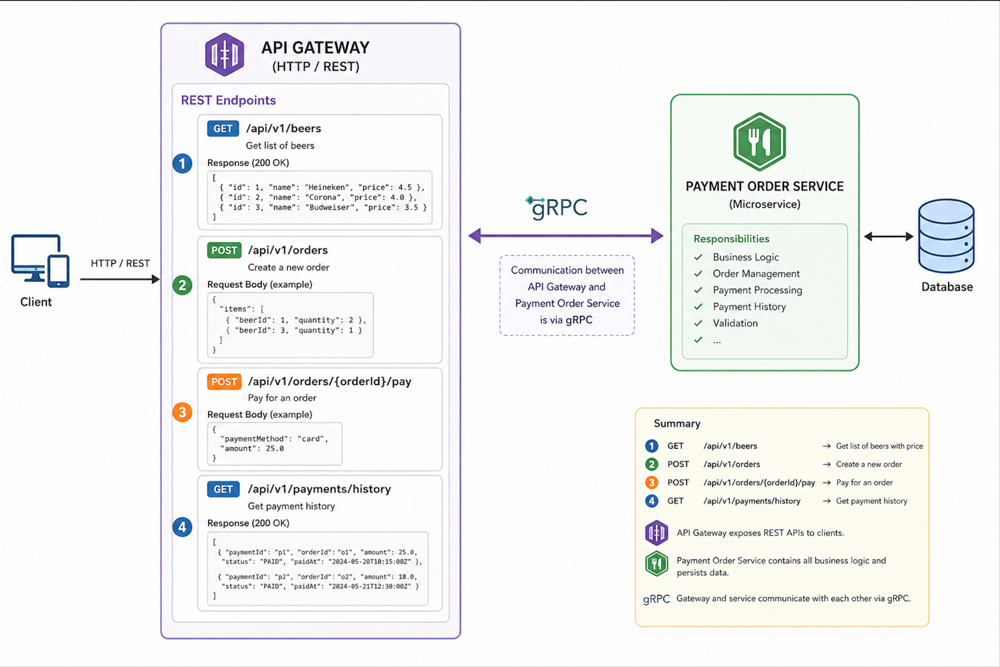

# grpc

Beverage Order System
Overview

The Beverage Order System is a microservice-based application that allows clients to browse available beverages, create orders, pay for orders, and retrieve order history.

The system follows a simple architecture where:

Clients communicate with the API Gateway using HTTP/REST.
The API Gateway communicates with backend services using gRPC.
The Beverage Order Service contains all business logic and persists data in a database


## Architecture

- API Gateway exposes REST APIs to clients
- Internal communication uses gRPC
- Beverage Order Service handles business logic
- mySQL stores beers, orders, and payments




## How to start the application

From the project root, start all services with Docker Compose:

```bash
docker-compose up --build
```

## API flow example
1. Get available beers

```bash
GET http://localhost:8080/beers

response:
[
  {
    "id": "11111111-1111-1111-1111-111111111111",
    "name": "Heineken",
    "price": 3.5
  },
  {
    "id": "22222222-2222-2222-2222-222222222222",
    "name": "Corona",
    "price": 4.0
  },
  {
    "id": "33333333-3333-3333-3333-333333333333",
    "name": "Amstel",
    "price": 6.0
  },
  {
    "id": "44444444-4444-4444-4444-444444444444",
    "name": "Bavaria",
    "price": 3.0
  }
]
```

2. Create an order

```bash
post http://localhost:8080/orders
Content-Type: application/json

{
  "items": [
    {
      "beerId": "11111111-1111-1111-1111-111111111111",
      "quantity": "2"
    },
    {
      "beerId": "44444444-4444-4444-4444-444444444444",
      "quantity": "2"
    }
  ]
}

response:
{
  "orderId": "1eb26582-494d-47d5-9699-fe457863c55f",
  "status": "CREATED",
  "totalAmount": 13.0,
  "createdAt": "2026-06-08T06:15:36.871498454Z"
}
```

3. Pay for the order

```bash
POST http://localhost:8080/api/v1/orders/1eb26582-494d-47d5-9699-fe457863c55f/pay
Content-Type: application/json

{
  "paymentMethod": "CARD",
  "amount": 12.5
}

response:
{
  "orderId": "1eb26582-494d-47d5-9699-fe457863c55f",
  "status": "PAID"
}
```

4. Get order history

```bash
GET http://localhost:8080/api/v1/orders

response:
[
  {
    "orderId": "1eb26582-494d-47d5-9699-fe457863c55f",
    "status": "PAID",
    "totalAmount": 13.0,
    "items": [
      {
        "beerId": "11111111-1111-1111-1111-111111111111",
        "beerName": "Heineken",
        "quantity": 2,
        "unitPrice": 3.5,
        "totalPrice": 7.0
      },
      {
        "beerId": "44444444-4444-4444-4444-444444444444",
        "beerName": "Bavaria",
        "quantity": 2,
        "unitPrice": 3.0,
        "totalPrice": 6.0
      }
    ],
    "createdAt": "2026-06-08T06:15:36.839725Z"
  },
  {
    "orderId": "38035876-3bfb-4aef-a579-029f505f5b57",
    "status": "CREATED",
    "totalAmount": 13.0,
    "items": [
      {
        "beerId": "44444444-4444-4444-4444-444444444444",
        "beerName": "Bavaria",
        "quantity": 2,
        "unitPrice": 3.0,
        "totalPrice": 6.0
      },
      {
        "beerId": "11111111-1111-1111-1111-111111111111",
        "beerName": "Heineken",
        "quantity": 2,
        "unitPrice": 3.5,
        "totalPrice": 7.0
      }
    ],
    "createdAt": "2026-06-08T05:57:03.604267Z"
  }
]
```
